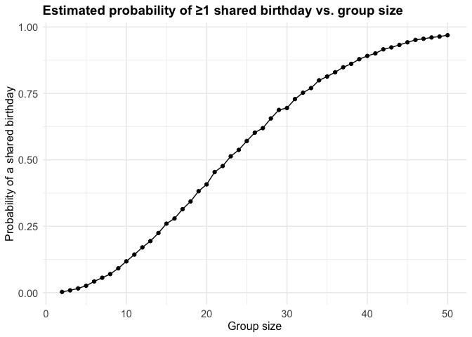
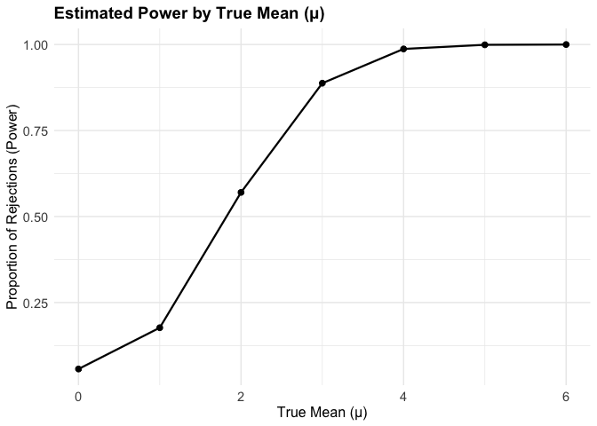
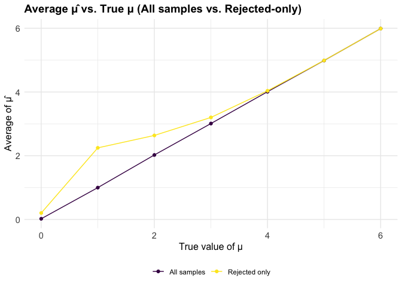
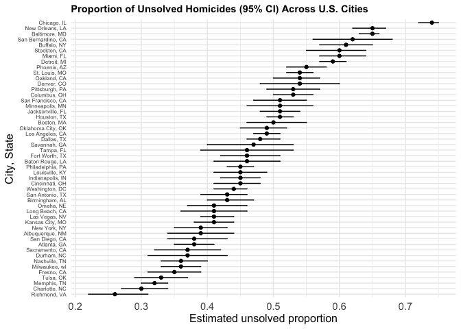

p8105_hw5_xz3312
================
Eric Zhang
2025-11-11

``` r
library(tidyverse)
```

    ## ── Attaching core tidyverse packages ──────────────────────── tidyverse 2.0.0 ──
    ## ✔ dplyr     1.1.4     ✔ readr     2.1.5
    ## ✔ forcats   1.0.0     ✔ stringr   1.5.1
    ## ✔ ggplot2   3.5.2     ✔ tibble    3.3.0
    ## ✔ lubridate 1.9.4     ✔ tidyr     1.3.1
    ## ✔ purrr     1.1.0     
    ## ── Conflicts ────────────────────────────────────────── tidyverse_conflicts() ──
    ## ✖ dplyr::filter() masks stats::filter()
    ## ✖ dplyr::lag()    masks stats::lag()
    ## ℹ Use the conflicted package (<http://conflicted.r-lib.org/>) to force all conflicts to become errors

``` r
library(ggplot2)
library(viridis)
```

    ## Loading required package: viridisLite

``` r
library(broom)
set.seed(1234)

theme_set(
  theme_minimal() +
    theme(
      legend.position = "bottom",
      plot.title = element_text(face = "bold", size = 14),
      axis.text = element_text(size = 11),
      axis.title = element_text(size = 12)
    )
)

options(
  ggplot2.continuous.colour = "viridis",
  ggplot2.continuous.fill  = "viridis"
)

scale_colour_discrete <- scale_colour_viridis_d
scale_fill_discrete   <- scale_fill_viridis_d
```

# Problem 1

### Suppose you put 𝑛 people in a room, and want to know the probability that at least two people share a birthday. For simplicity, we’ll assume there are no leap years (i.e. there are only 365 days) and that birthdays are uniformly distributed over the year (which is actually not the case). Write a function that, for a fixed group size, randomly draws “birthdays” for each person; checks whether there are duplicate birthdays in the group; and returns TRUE or FALSE based on the result.

``` r
# To simulate this, I define a function called birthday_simulation. For a chosen group size, the function randomly assigns each person a birthday by sampling from the integers 1 through 365 with replacement. If at least one birthday is shared the function returns TRUE.

birthday_simulation <- function(n) {
  birthdays <- sample(x = 1:365, size = n, replace = TRUE)
  return(length(birthdays) != length(unique(birthdays)))
}
```

### Run this function 10000 times for each group size between 2 and 50. For each group size, compute the probability that at least two people in the group will share a birthday by averaging across the 10000 simulation runs. Make a plot showing the probability as a function of group size, and comment on your results.

``` r
estimate_shared_bday <- function(n, B = 10000) {
  hits <- vapply(
    1:B,
    function(i) any(duplicated(sample.int(365, n, replace = TRUE))),
    logical(1)
  )
  mean(hits)
}

sizes <- 2:50
probability_table <- tibble(
  group_size = sizes,
  shared_birthday_prob = vapply(sizes, estimate_shared_bday, numeric(1))
)

ggplot(probability_table, aes(x = group_size, y = shared_birthday_prob)) +
  geom_line() +
  geom_point() +
  labs(
    title = "Estimated probability of ≥1 shared birthday vs. group size",
    x = "Group size",
    y = "Probability of a shared birthday"
  )
```

<!-- --> The
probability of a shared birthday between at least two people increases
quickly as the group size increases. For example, at a group size of 23,
the estimated probability crosses roughly 0.5. When the group size
approaches 50, the probability is approximately 0.969, showing that a
shared birthday becomes quite likely.

# Problem 2

### When designing an experiment or analysis, a common question is whether it is likely that a true effect will be detected – put differently, whether a false null hypothesis will be rejected. The probability that a false null hypothesis is rejected is referred to as power, and it depends on several factors, including: the sample size; the effect size; and the error variance. In this problem, you will conduct a simulation to explore power in a one-sample t-test.

``` r
# Function to generate dataset, return mean and p-value
simulate_mean_pval <- function(n = 30, mean_true = 0, sd_true = 5, mu_null = 0) {
  data_tbl <- tibble(values = rnorm(n, mean = mean_true, sd = sd_true))
  results <- data_tbl %>% 
    summarize(
      sample_mean = mean(values),
      p_value     = tidy(t.test(values, mu = mu_null))$p.value
    )
  results
}

# Parameters
n_iter    <- 5000
mean_grid <- 0:6  # μ = 0,1,2,3,4,5,6

# Simulation: 5000 per μ
sim_results_list <- purrr::map(mean_grid, function(mu_val) {
  tibble(iter = 1:n_iter) %>% 
    mutate(res = purrr::map(iter, ~simulate_mean_pval(
      n = 30, mean_true = mu_val, sd_true = 5, mu_null = 0
    ))) %>% 
    unnest(res)
})

names(sim_results_list) <- paste0("mu_", mean_grid)

# Combine all μ into one data frame
all_results <- purrr::map2_dfr(sim_results_list, mean_grid, ~mutate(.x, true_mu = .y))

# Power by μ (α = 0.05)
power_tbl <- all_results %>% 
  summarize(power = mean(p_value < 0.05), .by = true_mu)
```

As the true mean mu moves further from the null, power increases, which
shows there is positive association between power and effect size with
fixed n = 30 sd = 5.

### Make a plot showing the proportion of times the null was rejected (the power of the test) on the y axis and the true value of 𝜇 on the x axis. Describe the association between effect size and power.

``` r
all_results %>% 
  group_by(true_mu) %>% 
  summarize(power_est = mean(p_value < 0.05)) %>% 
  ggplot(aes(x = true_mu, y = power_est)) +
  geom_line(linewidth = 0.8) +
  geom_point(size = 2) +
  labs(
    title = "Estimated Power by True Mean (μ)",
    x = "True Mean (μ)",
    y = "Proportion of Rejections (Power)"
  )
```

<!-- -->
There is a positive relationship between power and effect size. The plot
demonstrates that power rises as the true mean (μ) moves further from
the null hypothesis. When μ is small (close to 0), the probability of
detecting a difference is low because the true mean is similar to the
null. As μ increases, the effect size grows, and the test becomes more
sensitive, making it easier to reject the null hypothesis.

### Make a plot showing the average estimate of 𝜇̂ on the y axis and the true value of 𝜇 on the x axis.Make a second plot (or overlay on the first) the average estimate of 𝜇̂ only in samples for which the null was rejected on the y axis and the true value of 𝜇 on the x axis. Is the sample average of 𝜇̂ across tests for which the null is rejected approximately equal to the true value of 𝜇? Why or why not?

``` r
# Average μ̂ across all samples for each true μ
overall_avg <- all_results %>% 
  summarize(mu_hat = mean(sample_mean), .by = true_mu)

# Average μ̂ only among samples where H0 was rejected
rejected_avg <- all_results %>% 
  filter(p_value < 0.05) %>% 
  summarize(mu_hat = mean(sample_mean), .by = true_mu)

# Combine for plotting
avg_tbl <- bind_rows(
  overall_avg  %>%  mutate(set = "All samples"),
  rejected_avg %>%  mutate(set = "Rejected only")
)

ggplot(avg_tbl, aes(x = true_mu, y = mu_hat, color = set)) +
  geom_line() +
  geom_point() +
  labs(
    title = "Average μ̂ vs. True μ (All samples vs. Rejected-only)",
    x = "True value of μ",
    y = "Average of μ̂",
    color = NULL
  )
```

<!-- --> The
sample average of mu hat among tests that reject the null is not
approximately equal to the true value of mu. This is because we are
looking at the subset of simulations where the test statistic was
extreme enough to produce a small p-value. This sampling bias inflates
the average value of mu hat among rejected tests.

# Problem 3

### Load washington post dataset and describe the raw data

``` r
# Load homicide data from washington post github
homicide_data <- read_csv(
  "https://raw.githubusercontent.com/washingtonpost/data-homicides/master/homicide-data.csv",
  show_col_types = FALSE
)
```

The homicide dataset includes 52179 records and 12 variables. It
documents homicide incidents across 50 major U.S. cities.

The variables provided include: - a unique case identifier (`uid`), -
the date the homicide was reported, - victim information (first and last
name, race, age, sex), - geographic details (city, state, latitude,
longitude), - the case disposition.

Together, these variables give detailed information of each homicide,
including victim demographics and investigation outcomes. During review,
one inconsistency was identified: the case `uid = "Tul-000769"` lists
the state as `"AL"`, though the incident occurred in Tulsa. Based on the
city name Tulsa, this state should be `"OK"`. This will be corrected in
cleaned data below.

### Create a city_state variable (e.g. “Baltimore, MD”) and then summarize within cities to obtain the total number of homicides and the number of unsolved homicides (those for which the disposition is “Closed without arrest” or “Open/No arrest”). For the city of Baltimore, MD, use the prop.test function to estimate the proportion of homicides that are unsolved; save the output of prop.test as an R object, apply the broom::tidy to this object and pull the estimated proportion and confidence intervals from the resulting tidy dataframe.

``` r
# Fix the miscoded state for one Tulsa observation
homicide_data <- homicide_data %>% 
  mutate(
    state = if_else(uid == "Tul-000769", "OK", state)
  )

# Create city state and summarize total + unsolved homicides by city
city_summary <- homicide_data %>% 
  mutate(
    city_state = str_c(city, ", ", state),
    unsolved   = disposition %in% c("Closed without arrest", "Open/No arrest")
  ) %>% 
  summarize(
    total_homicides    = n(),
    unsolved_homicides = sum(unsolved),
    .by = city_state
  )

# Extract counts for Baltimore MD and run a proportion test
baltimore_counts <- city_summary %>% 
  filter(city_state == "Baltimore, MD")

baltimore_prop_test <- prop.test(
  x = baltimore_counts$unsolved_homicides,
  n = baltimore_counts$total_homicides
)

baltimore_prop_tidy <- broom::tidy(baltimore_prop_test)
```

In Baltimore, MD, the estimated proportion of homicides that are
unsolved is 0.65. Based on this model, the 95% confidence interval for
the true proportion ranges from 0.63 to 0.66.

### Now run prop.test for each of the cities in your dataset, and extract both the proportion of unsolved homicides and the confidence interval for each. Do this within a “tidy” pipeline, making use of purrr::map, purrr::map2, list columns and unnest as necessary to create a tidy dataframe with estimated proportions and CIs for each city.

``` r
library(purrr)
library(broom)

# One prop.test per city in one tidy dataframe, with estimated proportions and CIs for every city
city_prop_summary <- city_summary %>% 
  mutate(
    prop_test = map2(
      unsolved_homicides,
      total_homicides,
      ~ prop.test(x = .x, n = .y)
    ),
    prop_test_tidy = map(prop_test, tidy)
  ) %>% 
  unnest(prop_test_tidy) %>% 
  select(city_state, estimate, conf.low, conf.high) %>% 
  mutate(
    estimate = round(estimate, 2),
    conf.low = round(conf.low, 2),
    conf.high = round(conf.high, 2)
  )
```

### Create a plot that shows the estimates and CIs for each city – check out geom_errorbar for a way to add error bars based on the upper and lower limits. Organize cities according to the proportion of unsolved homicides.

``` r
city_prop_summary %>% 
  ggplot(aes(
    x = reorder(city_state, estimate),
    y = estimate,
    ymin = conf.low,
    ymax = conf.high
  )) +
  geom_point() +
  geom_errorbar(width = 0.15) +
  coord_flip() +
  labs(
    title = "Proportion of Unsolved Homicides (95% CI) Across U.S. Cities",
    x = "City, State",
    y = "Estimated unsolved proportion"
  ) +
  theme(
    axis.text.y = element_text(size = 6),
    plot.title = element_text(size = 11)
  )
```

<!-- -->

Across the 50 cities in the dataset, the estimated proportion of
unsolved homicides varies widely. The city with the **lowest** estimated
proportion is Richmond, VA at about 0.26, while the **highest** occurs
in Chicago, IL with an estimate near 0.74. The confidence intervals also
differ substantially across cities, reflecting differences in sample
sizes. Overall, the plot shows that cities with larger unsolved
proportions tend to cluster toward the top of the reordered axis,
emphasizing substantial variation in clearance rates nationwide.
